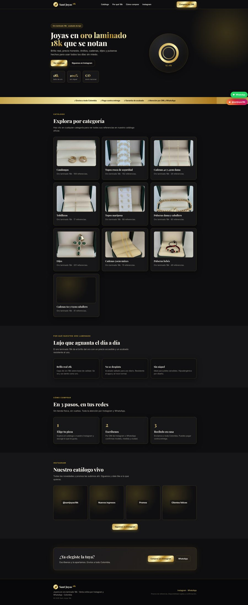

# Holfkings Arenas 👋 Desarrollador Web Freelance

> Sitios web premium en **HTML/CSS/JS**, **WordPress** y **apps Python/Flask**.
> De Cúcuta, Colombia 🇨🇴 para el mundo.

¿Buscas una página web que se vea profesional, cargue rápido y convierta visitas en clientes? Ese es mi trabajo.

## 🚀 Lo que hago
- **Sitios web a medida** (HTML/CSS/JS limpio, sin builders cerrados).
- **Tiendas y catálogos** (WordPress, WooCommerce, catálogos conectados a Instagram/WhatsApp).
- **Apps y herramientas** en Python / Flask (RAG, OCR, automatizaciones).
- **SEO técnico** real: datos estructurados, Open Graph, sitemap, Core Web Vitals.
- **Rediseño** de sitios en Wix/plataformas cerradas para recuperar el control.

## 💼 Proyectos reales

### Sant Joyas 18k — Joyería en oro laminado
Catálogo real conectado a Instagram y WhatsApp, estética de lujo oro-sobre-negro.
[Ver sitio →](https://holfkings.github.io/santjoyas-site/)

### CEGESAN — Institución Educativa
Sitio institucional migrado de Wix a sitio propio con SEO técnico y datos estructurados.
[Ver sitio →](https://holfkings.github.io/cegesan-site/)

## 🛠️ Stack
`HTML5` · `CSS3` · `JavaScript` · `WordPress` · `Python` · `Flask` · `Git` · `SEO`

## 📫 ¿Hablamos?
- WhatsApp: [315 557 6332](https://wa.me/573155576332)
- GitHub: [@Holfkings](https://github.com/Holfkings)
- Instagram (joyería): [@santjoyas18k](https://www.instagram.com/santjoyas18k/)

---
⚡ Disponible para nuevos proyectos. Precios introductorios a cambio de tu reseña.
